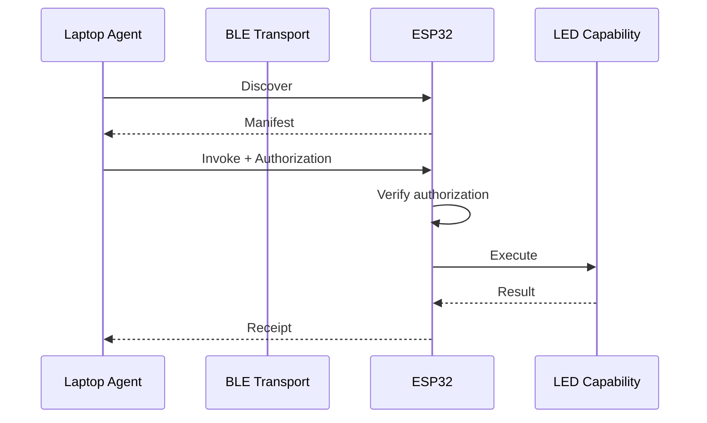

The right MVP is **not “Solana payment on an ESP32.”** Build a small transport-independent capability protocol where an ESP32 is the first provider, a laptop is the first buyer/agent, BLE is the first transport, and payment is an adapter added after the capability flow works.

Below is the prompt I would hand directly to the coding agent.

---

# CapMesh MVP — Agent Implementation Brief

## 1. Mission

Build a working proof of concept for a **local machine capability marketplace**.

An arbitrary client should be able to:

```text
discover device
→ inspect capabilities
→ request a capability
→ satisfy authorization/payment policy
→ invoke capability
→ receive signed/verifiable receipt
```

Initial implementation:

```text
Linux laptop / agent
        |
       BLE
        |
      ESP32
        |
   onboard LED
```

The LED is deliberately trivial. It represents any future actuator:

```text
LED
relay
lock
motor
sensor
camera
network relay
compute service
charger
robot
```

The architecture must allow later implementations on:

* additional ESP32 devices;
* Linux/macOS/Windows computers;
* Android phones, especially Solana Seeker;
* Wi-Fi-connected devices;
* HTTP/internet services;
* actual physical actuators/sensors.

Do not optimize specifically for EV charging.

## 2. Product thesis

A machine should be able to encounter another machine it has never previously integrated with and answer:

```text
What can you do?
What does it cost?
How can I trust you?
How do I authorize this action?
Can I invoke it?
What proof do I receive afterward?
```

Long-term:

```text
Agent goal
    ↓
Capability discovery
    ↓
Provider selection
    ↓
Trust / policy / payment
    ↓
Invocation
    ↓
Physical or digital result
    ↓
Receipt / settlement
```

Tonight we are proving only the smallest useful slice.

## 3. Operating instructions for the coding agent

Act autonomously, but keep the user informed.

Before writing significant code:

1. Inspect the laptop environment.
2. Identify the exact ESP32 board/chip.
3. Check USB serial access.
4. Check installed ESP-IDF/Rust/Python/Bluetooth tooling.
5. Inspect Bluetooth and Wi-Fi interfaces.
6. Verify the onboard LED/GPIO configuration.
7. Report the discovered environment and the proposed implementation path.
8. Ask only questions that materially block implementation.

Do not blindly follow this document when the actual hardware or installed environment suggests a simpler approach.

You have permission to use the laptop to:

* build and flash firmware;
* inspect serial ports;
* scan/test Bluetooth;
* use `bluetoothctl`;
* inspect networking with normal Linux tooling;
* test Wi-Fi communication;
* run local services;
* run automated integration tests;
* create and push to the private GitHub repository described below.

Do not:

* expose wallet private keys or seed phrases;
* commit secrets;
* use meaningful mainnet funds;
* disable security controls globally;
* alter unrelated laptop configuration;
* make the repository public;
* install large/unnecessary stacks without explaining why;
* rewrite working architecture simply because another framework is fashionable.

If `sudo`, destructive configuration, wallet authorization, physical verification, or another meaningful user action is required, stop and explain exactly what is required and why.

### Communication requirement

The user is learning this system.

At each milestone, briefly report:

```text
What now works
How it works
What files implement it
How we verified it
What remains fake/mock
What comes next
```

Never silently substitute a mock and imply the real feature works.

## 4. Repository setup — do this first

Create a small **private** GitHub repository using the authenticated GitHub CLI. `gh repo create` officially supports private repository creation and cloning. ([GitHub CLI][1])

Suggested repository:

```bash
gh repo create capmesh-poc \
  --private \
  --clone \
  --description "Local capability discovery, authorization and machine-to-machine payments POC"
```

If that name exists, choose a sensible variant without blocking on the user.

Initial structure:

```text
capmesh-poc/
├── firmware/
│   └── esp32/
├── host/
├── protocol/
├── scripts/
├── tests/
├── docs/
│   ├── ARCHITECTURE.md
│   ├── PROTOCOL.md
│   ├── DECISIONS.md
│   └── LEARNING.md
└── README.md
```

Keep it simpler if the tooling naturally suggests a cleaner layout.

Commit after each working milestone.

## 5. Architecture

Keep these layers separated:

```text
┌────────────────────────────────┐
│ Agent / Application            │
│ "find visible signal < $0.01"  │
├────────────────────────────────┤
│ Capability Protocol            │
│ discover / quote / invoke      │
│ authorization / receipt        │
├────────────────────────────────┤
│ Trust + Payment Adapter        │
│ mock → signed auth → Solana    │
├────────────────────────────────┤
│ Transport                      │
│ BLE → Wi-Fi → HTTP             │
├────────────────────────────────┤
│ Device Adapter                 │
│ ESP32 / Android / Linux / ...  │
├────────────────────────────────┤
│ Capability                     │
│ LED / sensor / relay / etc.    │
└────────────────────────────────┘
```

This separation is a hard requirement.

Business/capability messages must not depend directly on BLE.

BLE, Wi-Fi and HTTP should eventually carry approximately the same logical protocol.

## 6. Minimal protocol

Start with JSON for debuggability.

Do not prematurely introduce protobuf, blockchain serialization, ZK systems, custom cryptography, or complicated schemas.

Example manifest:

```json
{
  "protocol": "capmesh/0.1",
  "device_id": "esp32-ab12",
  "capabilities": [
    {
      "id": "led.blink",
      "description": "Blink onboard LED",
      "pricing": {
        "model": "fixed",
        "amount": "0.001",
        "currency": "mock-usdc"
      }
    }
  ]
}
```

Conceptual message flow:

```text
DISCOVER
   ↓
MANIFEST
   ↓
QUOTE / REQUEST
   ↓
AUTHORIZATION
   ↓
INVOKE
   ↓
RESULT
   ↓
RECEIPT
```

Every state-changing request should eventually include:

```text
request_id
device_id
capability
parameters
nonce
expiration
authorization
```

Receipts should eventually contain:

```text
request_id
provider
capability
parameters/result
started_at
completed_at
authorization reference
receipt signature/authenticator
```

Exact serialization is not important tonight. Clean semantics are.

## 7. Implementation sequence

### Phase 0 — establish hardware truth

Before architecture work:

* identify chip;
* identify toolchain;
* compile official minimal firmware;
* flash;
* confirm serial logs;
* blink LED locally.

Do not continue until this is reproducible.

### Phase 1 — BLE transport

ESP32 becomes a BLE peripheral/provider.

Laptop becomes BLE central/client.

Use ESP-IDF's supported BLE stack and start from an official example rather than creating Bluetooth plumbing from scratch. ESP-IDF provides NimBLE peripheral/GATT examples and documents GATT server support. ([Espressif Systems][2])

Target:

```bash
capmesh scan
```

outputs something equivalent to:

```text
esp32-ab12
  led.blink
  price: 0.001 mock-USDC
```

Then:

```bash
capmesh invoke esp32-ab12 led.blink --duration 5
```

makes the LED blink.

At this stage authorization may explicitly be `mock`.

### Phase 2 — protocol boundary

Refactor only enough that:

```text
BLE packet
      ↓
transport decoder
      ↓
CapMesh request
      ↓
capability dispatcher
      ↓
LED implementation
```

The LED code must know nothing about BLE.

This is what later permits:

```text
BLE ────┐
Wi-Fi ──┼→ same protocol → same capability
HTTP ───┘
```

### Phase 3 — authorization/trust

Add:

* unique request IDs;
* nonce;
* expiration;
* replay protection;
* authenticated authorization;
* receipt generation.

For the first embedded implementation, choose the simplest well-supported cryptographic mechanism available in the existing ESP-IDF environment.

Do **not** invent cryptography.

If Ed25519 verification can be added cleanly using a well-maintained implementation, prefer it because Solana uses Ed25519. If doing so threatens tonight's working demo, use a clearly labeled temporary HMAC authorization and document the replacement.

Test:

```text
valid authorization      → executes
invalid authorization    → rejected
expired authorization    → rejected
replayed authorization   → rejected
```

### Phase 4 — Wi-Fi transport

Only after BLE works.

Expose the same capability protocol through a tiny HTTP server.

ESP-IDF includes a lightweight embedded HTTP server suitable for this. ([Espressif Systems][3])

Conceptually:

```text
GET  /manifest
POST /invoke
GET  /receipt/<id>
```

Do not duplicate capability logic.

Successful result:

```text
BLE request  ─┐
              ├→ identical LED capability
HTTP request ─┘
```

### Phase 5 — Solana adapter

Do this after the local trust model works.

Do not put RPC/network settlement logic directly into the ESP32 firmware.

Preferred MVP:

```text
wallet / payer
      ↓
Solana devnet
      ↓
host verifies authorization/payment
      ↓
host issues bounded capability authorization
      ↓ BLE
ESP32 verifies authorization
      ↓
executes
```

Solana currently documents agent payment flows around MPP and x402; x402 V2 uses a resource/payment-requirement/authorization/receipt flow that is conceptually useful here, but x402 itself is an HTTP protocol and should **not** simply be mislabeled as a BLE protocol. ([Solana][4])

Keep payment behind an interface such as:

```text
PaymentVerifier

MockPaymentVerifier
SolanaDevnetVerifier
FuturePaymentChannelVerifier
```

Solana payment channels are especially relevant to later metered capabilities because they escrow a ceiling and settle actual usage from signed off-chain vouchers. Do not make them a dependency for tonight's MVP. ([GitHub][5])

No meaningful mainnet funds.

## 8. Multi-device demonstration

Once one ESP32 works, make the architecture prove it isn't ESP-specific.

The cheapest second provider is probably the laptop itself.

Example:

```text
ESP32
  led.blink       0.001

Laptop
  compute.sha256  0.002
  storage.echo    0.001
```

Then make:

```bash
capmesh scan
```

discover multiple providers.

Later add:

```text
ESP32 #2
Android / Seeker
another laptop
```

Do not hard-code device-specific decisions into the agent.

## 9. Seeker / Android future path

The Android implementation should eventually be able to operate as both:

```text
buyer/client
provider/device
```

Possible capabilities:

```text
notification.show
vibrate
camera.capture
location.request
network.relay
compute.*
wallet.authorize
```

Solana Mobile's Mobile Wallet Adapter supports wallet-mediated transaction/message signing on Android, making Seeker useful as the user's high-level economic authority rather than requiring private keys on embedded devices. ([Solana Mobile Docs][6])

Do not build the Android app unless the ESP32/laptop foundation is already solid.

## 10. Agent/planner layer

Do not add an LLM until deterministic discovery works.

First:

```text
list devices
list capabilities
invoke named capability
```

Then deterministic policy selection:

```text
find providers with led/display capability
filter price <= X
choose cheapest
invoke
```

Only afterward support:

> “Find a nearby device capable of producing a visible signal for under $0.01 and activate it.”

LLM reasoning belongs above the protocol, never inside the security boundary.

## 11. Testing

Automate whatever can be automated.

Minimum tests:

```text
protocol serialization
manifest parsing
unknown capability rejection
invalid arguments
authorization failure
expiration
nonce replay
successful invocation
receipt correlation
BLE reconnect
device reboot
```

Integration test:

```text
flash device
→ scan
→ retrieve manifest
→ authorize
→ invoke LED
→ obtain receipt
→ attempt replay
→ verify rejection
```

For physical LED behavior, explicitly ask the user:

> “The automated protocol passed. Please confirm whether the ESP32 LED blinked for approximately five seconds.”

Separate machine-verifiable success from human physical verification.

## 12. Documentation requirement

Maintain Mermaid diagrams rather than screenshots wherever possible.

`ARCHITECTURE.md` should contain:



`LEARNING.md` is specifically for the user. After major milestones explain, briefly:

* what BLE central/peripheral means;
* what GATT service/characteristics are;
* where discovery happens;
* where authorization happens;
* why the transport is separated;
* where Solana eventually enters;
* which security guarantees exist versus remain mocked.

Do not fill it with generic tutorial prose.

## 13. Tonight's definition of done

The core success criterion is:

> A laptop discovers an ESP32 without knowing its device-specific implementation, reads an advertised capability, obtains authorization, invokes that capability over BLE, causes the physical LED to react, receives a receipt, and cannot replay the same authorization.

Strong stretch goal:

```text
same capability works through BLE and Wi-Fi
```

Excellent stretch goal:

```text
two independent providers expose the same protocol
and the host chooses between them according to policy
```

Solana settlement is secondary to getting this architecture right.

## 14. Explicit non-goals tonight

Do not burn time on:

* custom on-chain programs;
* production token economics;
* UI;
* branding;
* ZK proofs;
* secure elements;
* full decentralized identity;
* BLE Mesh;
* elaborate protobuf schemas;
* production wallet custody;
* autonomous LLM planning;
* Android application development;
* real stablecoin funds;
* arbitrary physical hardware.

Leave clean extension points instead.

## 15. Future research questions

Record these in `docs/DECISIONS.md`; do not solve them prematurely.

1. Should device identity use persistent keys or rotating privacy-preserving identities?
2. How can a buyer verify that a physical capability was actually delivered?
3. Can one prepaid/payment-channel balance authorize payments to previously unknown providers?
4. How should offline double-spend risk be bounded?
5. How do devices establish reputation without creating globally trackable identities?
6. When should capability tokens use wallet signatures, delegated/session keys, attestations, or hardware-backed keys?
7. How should metered services continuously authorize additional consumption?
8. How should discovery scale from BLE proximity → LAN → internet?
9. How can multiple capabilities be composed atomically or conditionally?
10. What does a safe spending policy for an autonomous agent look like?
11. What information belongs on-chain versus only between buyer/provider?
12. Can receipts become useful proofs for reputation, dispute resolution, or machine accounting?

These are potential research directions. Keep today's code sufficiently modular to investigate them later, but do not overengineer for hypothetical requirements.

## 16. Rules when blocked

When stuck:

1. Inspect evidence first.
2. Read the official documentation/example.
3. Reduce the problem to the smallest failing test.
4. Explain the failure to the user.
5. Try the least invasive fix.
6. Preserve logs/errors.
7. Do not paper over the problem with mocks without explicitly labeling them.

If blocked for more than a reasonable amount of time on a nonessential implementation choice, choose the simplest reversible alternative and continue.

---

The agent should start from Espressif's official NimBLE examples rather than generating BLE firmware from memory. ESP-IDF explicitly provides NimBLE and GATT peripheral examples, plus a BLE UART example if a simple serial-like transport proves faster. ([Espressif Systems][7])

Useful source material for the agent: [ESP-IDF BLE/NimBLE documentation](https://docs.espressif.com/projects/esp-idf/en/latest/esp32/api-reference/bluetooth/nimble/index.html?utm_source=chatgpt.com) · [ESP-IDF HTTP server](https://docs.espressif.com/projects/esp-idf/en/latest/esp32/api-reference/protocols/esp_http_server.html?utm_source=chatgpt.com) · [Solana agentic payments](https://solana.com/docs/payments/agentic-payments?utm_source=chatgpt.com) · [Solana x402 V2](https://solana.com/docs/payments/agentic-payments/x402?utm_source=chatgpt.com) · [Solana payment channels repository](https://github.com/solana-foundation/payment-channels?utm_source=chatgpt.com) · [GitHub CLI repo creation](https://cli.github.com/manual/gh_repo_create?utm_source=chatgpt.com).

The only blocking facts I would expect the coding agent to determine or ask you about are the **exact ESP32 model**, whether its onboard LED is usable, and whether the Seeker is physically available during this build. Everything else can be discovered or safely defaulted.

[1]: https://cli.github.com/manual/gh_repo_create?utm_source=chatgpt.com "GitHub CLI | Take GitHub to the command line"
[2]: https://docs.espressif.com/projects/esp-idf/en/stable/esp32/api-guides/ble/get-started/ble-introduction.html?utm_source=chatgpt.com "Introduction - ESP32 - — ESP-IDF Programming Guide v6.1 documentation"
[3]: https://docs.espressif.com/projects/esp-idf/en/latest/esp32/api-reference/protocols/esp_http_server.html?utm_source=chatgpt.com "HTTP Server - ESP32 - — ESP-IDF Programming Guide latest documentation"
[4]: https://solana.com/docs/payments/agentic-payments?utm_source=chatgpt.com "Agentic Payments on Solana with MPP and x402"
[5]: https://github.com/solana-foundation/payment-channels/blob/main/README.md?utm_source=chatgpt.com "payment-channels/README.md at main · solana-foundation/payment-channels · GitHub"
[6]: https://docs.solanamobile.com/react-native/metaplex_integration?utm_source=chatgpt.com "Metaplex Integration Guide - Solana Mobile Docs"
[7]: https://docs.espressif.com/projects/esp-idf/en/stable/esp32/api-reference/bluetooth/index.html?utm_source=chatgpt.com "Bluetooth® API - ESP32 - — ESP-IDF Programming Guide v6.1 documentation"
