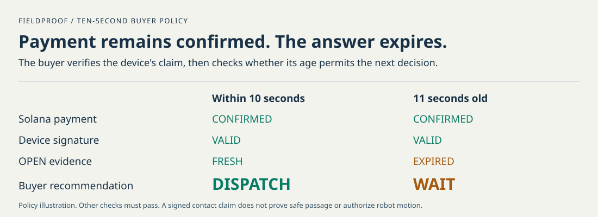

# FieldProof

**Fresh physical proof for machine-to-machine commerce.**

**Try FieldProof:** [public receipt inspector](https://epicexcelsior.github.io/fieldproof/) · [interactive guide](https://epicexcelsior.github.io/fieldproof/guide.html) · [captioned 2:30 technical walkthrough](https://epicexcelsior.github.io/fieldproof/assets/fieldproof-signed-receipt.webm).

The public inspector verifies recorded real ESP32 evidence. Select **Verify original**, then change the state, challenge, or key.
Select **Verify recorded payment** for a read-only Solana Devnet query.
The recorded receipt is expired, so its decision remains WAIT. The guide labels its interactive examples as teaching models.
No hosted action creates a payment or reads hardware. Use [Run without hardware](#run-without-hardware) for the complete simulated purchase.

**Deployment:** Solana Devnet, 0.001 Devnet USDC per real observation. No custom Solana program.

Machines can pay online. Payment does not tell a visiting robot whether another operator's gate is open now.
FieldProof purchases a contact observation on Solana and verifies the device's signed answer before a demo `DISPATCH` or `WAIT` recommendation.

**A confirmed payment and a valid signature can outlive the answer's useful window. The buyer must still check its age.**



## What works today

```text
Buyer asks a question and sets a 10-second age limit
  → x402 quotes 0.001 Devnet USDC
  → Solana settles payment
  → ESP32 measures its contact and signs the answer
  → buyer verifies the key, challenge, samples, and age
  → fresh OPEN: DISPATCH · closed, stale, or rejected: WAIT
```

The October 5 purchase used real Devnet test USDC and a real ESP32-C6 input.
The laptop and Seeker independently verified its payment and fresh receipt. Both changed to WAIT after expiry.
See [the actual Solana transaction](https://explorer.solana.com/tx/5Rqq2o1GeAX2TXDYf7NXLFAxZnunkxqQz8tpnh5musVi5poZd6jhtDs1axpFy7EHuWh4h3EU4xchbkbNpXMoXttz?cluster=devnet) and [public buyer output](docs/evidence/device-signed-purchase-20261005.json).

BOOT represents the gate contact. The signature authenticates the device's claim, not physical truth or safe passage.
The device signs the question and answer. The gateway ledger associates that question with the purchase.
Payment and delivery remain separate. This MVP controls no gate and moves no robot.
The phone acts as a second browser verifier, not another sensor or payer.

**Learn:** [illustrated guide](docs/HOW_IT_WORKS.html). **Record:** [one founder-led walkthrough](docs/RECORDING_SCRIPT.md).
**Submit:** [remaining human tasks](docs/SUBMISSION.md#required-fields-that-remain-incomplete).
The [documentation map](docs/README.md) routes specific questions. The [verification record](docs/VERIFICATION.md) records executed checks and limits.

## Where this goes

The company hypothesis is one integration for fleets to transact with physical infrastructure another operator owns.
Test one fleet and one authorized facility, then a second facility to measure integration reuse.
Paid integration and support come first. Recurring software fees and service-transaction fees follow demonstrated demand.
Customer demand, pricing, access control, completed-service evidence, and network effects remain unvalidated.
See [the strategy and existing alternatives](docs/STRATEGY.md).

## Run without hardware

Prerequisites: Python 3.10+, `uv`, and Node.js 22.13+ with `node:sqlite`.
Start each command block at the repository root. Stop a running gateway with Ctrl+C before changing modes.

```bash
uv sync --project host
npm --prefix gateway ci
python3 scripts/demo.py sim
```

Open `http://127.0.0.1:4022`. Select **Get payment quote**, then **Run simulation**.
Add `?present=1` for a compact recording view. Its **Request observation** button uses the same simulated purchase.
The simulator uses the real x402 resource-server SDK with a fake facilitator. It moves no funds.
Fresh OPEN produces DISPATCH. The same evidence expires to WAIT after its age limit.
Open `/proof?present=1` for recorded hardware evidence, receipt attacks, and the independent Solana payment query.
The authentic recorded receipt is expired today. Verification cannot refresh it.

Run `python3 scripts/demo.py check` to verify prerequisites.
The launcher also provides `board`, `physical`, `cases`, and `guide`. It never pays, flashes, or drives a GPIO output.
The [demo runbook](docs/DEMO.md) owns the live payment procedure and recovery.

For one-click actual payment with the attached ESP32 and a funded disposable Devnet wallet:

```bash
node gateway/live-demo.js /path/to/disposable-devnet.keypair.json
```

Open `http://127.0.0.1:4026/proof?present=1`. Select **Pay 0.001 USDC**.
The laptop signs once. The page shows the actual transfer, signed reading, elapsed time, and current evidence age.
Simulation stays separate. See [setup, limits, and failure recovery](docs/DEMO.md#pay-and-read-with-one-click).
The [latest verified October 5 click output](docs/evidence/device-signed-purchase-fast-20261005.json) records an actual paid OPEN reading and its unchanged signature.

<details>
<summary>CLI attack checks and optional two-observer rehearsal</summary>

```bash
uv run --project host fieldproof observe-demo --simulated
uv run --project host fieldproof observe-demo --simulated --closed
uv run --project host fieldproof corroborate-demo --scenario all
```

The CLI rejects stale providers, replayed answers, altered answers, and replayed device requests. It records local test demand.
The pair rehearsal uses temporary signed fixtures. Missing, conflicting, stale, invalid, skewed, or replayed evidence produces WAIT.
It uses no hardware and moves no funds. Run `npm --prefix gateway run demo -- --closed` for the closed-contact browser rehearsal.

</details>

## Inspect the recorded physical purchase

With a local gateway running, open `http://127.0.0.1:4022/proof`.
The browser verifies the actual device signature and rejects a changed state, another challenge, and another key.
Select **Focus demo** for a compact presentation view. The same verifier and current-time freshness checks remain active.
Select **Verify recorded payment** for an independent, read-only Solana Devnet transaction query.
The chain check verifies the mint, payer, merchant, transfer instruction, and exact token balance changes.
The inspector also verifies both recorded BOOT states against the same device pin. Those separate input checks moved no funds.
The default inspector purchases no evidence and invokes no hardware. The authentic recorded receipt is expired and stays WAIT.
Open `/proof#payment` to see buyer → 0.001 Devnet USDC → merchant. Select **Verify recorded payment** for a read-only current chain query.
The simulator creates no Solana transaction. A new real transaction requires the configured Devnet gateway and independent paid buyer.

Export a standalone inspector for judge review:

```bash
python3 scripts/export_judge_demo.py .local/judge-demo
python3 -m http.server 8787 --bind 127.0.0.1 --directory .local/judge-demo
```

Open `http://127.0.0.1:8787`. The exporter also creates `.local/judge-demo.zip` and a SHA256 manifest.
It copies a fixed public asset list: guide, evidence, browser code, verification pin, diagram, and current technical video.
Open `/guide.html` in the exported package for the self-contained story, radio explanation, and rehearsal.
The guide labels its interactive examples as teaching models. Its receipt link opens the actual browser verifier.
It refuses to overwrite an existing directory or archive. Select a new output name for another export.
This package inspects recorded evidence. Use the simulator commands above to exercise a complete purchase without funding.
The [public inspector](https://epicexcelsior.github.io/fieldproof/) serves the exported directory on HTTPS through GitHub Pages.

## Run with the ESP32

The attached board uses the restored GPIO9 BOOT application. New held/released browser checks passed after restoration.
The GPIO20 foil experiment remains incomplete. See [the input setup](docs/CONTACT_SETUP.md).
For another board, follow [trusted identity provisioning](docs/RECEIPT_IDENTITY.md#provision-a-new-board) before live verification.
A newly generated key cannot match the checked-in demonstration pin.

Build with ESP-IDF 6.1. The current board uses `/dev/ttyACM0`.
Activate the environment created by your ESP-IDF installer first.
With Espressif Installation Manager, source its generated `activate_idf_v6.1.sh`.
With the standard installer, set `IDF_PATH` and source `"$IDF_PATH/export.sh"`.
The two installers use different tool and Python environment paths.

```bash
(cd firmware/esp32 && idf.py build)
uv run --project host fieldproof observe-demo
```

Keep other BLE scans closed. Live mode fails when the board is unavailable. It never substitutes simulated hardware.
For HTTP, connect to the board's `CAPMESH_96A2` access point and use `fieldproof observe-demo --http-url http://192.168.4.1`.
On Linux with overlapping VPN routes, add `--http-interface wlp2s0` and use your Wi-Fi interface name.
The new observation path and replay rejection are verified over physical Wi-Fi.

For the browser with real hardware and simulated payment:

```bash
npm --prefix gateway run demo -- --physical
```

Hold BOOT while the observation runs to represent a closed contact. Release BOOT to represent an open contact.
Do not hold BOOT during reset or flashing. GPIO9 is a boot strap.
Human press/release verification passed: held BOOT produced CLOSED/WAIT, and released BOOT produced OPEN/DISPATCH. Both states returned five matching samples.

The firmware supports an explicitly configured dry-contact input. GPIO9 remains the default.
The host accepts `--provider`, `--sensor`, and `--pins` for operator-selected physical profiles.
The gateway uses `FIELDPROOF_PROVIDER_ID`, `FIELDPROOF_CONTACT_SENSOR`, and `FIELDPROOF_RECEIPT_PINS`.
The paid buyer accepts the same three settings as CLI flags. Pin-file paths are relative to the repository root in these commands.
The [setup guide](docs/CONTACT_SETUP.md) separates successful software checks from pending physical verification.

## Run the Devnet payment gateway

```bash
npm --prefix gateway start
```

The gateway binds to `127.0.0.1:4021`. It offers x402 V2 `exact` payment for 1,000 base units of Devnet USDC.
An unpaid request returns `402` and `PAYMENT-REQUIRED`. Verification and successful settlement precede measurement.
A public-facilitator purchase completed on October 1, 2026. Independent Devnet RPC checks confirmed the exact USDC transfer before the physical measurement.
See the [paid device-signed receipt](docs/evidence/device-signed-purchase.json) and [device-signed physical state checks](docs/evidence/device-signed-contact-states.json).

Create a purchase with `POST /requests` and a positive 32-bit `nonce`.
Request its `observe_url` with a compatible x402 client.
The included client requires a disposable Solana CLI keypair with Devnet USDC:

```bash
node gateway/buyer.js /path/to/disposable.keypair.json
```

The client rejects other networks, assets, recipients, and amounts above 0.001 USDC.
It checks the device receipt independently and derives its decision from the contact state.
It compares the selected provider, sensor, and its trusted public pin with the quote before payment.
The gateway stores those terms and rejects an older quote after configuration changes.
It never prints key material. Do not use a funded mainnet keypair.

The [paid-run procedure](docs/DEMO.md#show-one-new-paid-buyer-run) connects `--output` to the browser's two-minute monitor.
It also configures the Seeker as a portable verifier through USB forwarding.
The [October 5 buyer output](docs/evidence/device-signed-purchase-20261005.json) preserves the actual purchase both browsers verified.
Both accepted fresh OPEN and changed to expired WAIT. The phone supplies no sensor data and signs no payment.

Retries return the original evidence without a second settlement or measurement.
The browser stops dispatch after its freshness window. A cached receipt does not become fresh on retry.
Unknown settlement and paid delivery failure require manual review. See the [demo and recovery runbook](docs/DEMO.md).

## Verify

```bash
uv run --project host pytest -q
uv run --project host pytest -q --hardware
npm --prefix gateway test
```

With the full simulator running, verify its browser purchase and the recorded inspector:

```bash
node scripts/check_purchase_ui.cjs /path/to/playwright http://127.0.0.1:4022
node scripts/check_receipt_ui.cjs /path/to/playwright http://127.0.0.1:4022
```

The purchase check refuses physical evidence and real-payment gateways. It verifies simulation, configured terms, expiry, and phone width.

The default Python run skips hardware tests explicitly. `--hardware` requires the board and fails if it is unavailable.
There is no declared Python formatter or type checker in the original repository.
The [verification record](docs/VERIFICATION.md) lists executed checks and remaining gaps.

## Architecture and limits

- [Protocol](docs/PROTOCOL.md): authenticated requests, observation receipts, freshness, and replay limits.
- [Architecture](docs/ARCHITECTURE.md): device, buyer, gateway, ledgers, and payment boundaries.
- [Overview](docs/OVERVIEW.md): pivot, verified results, strategy, and unfinished acceptance gates.
- [peaq integration](docs/PEAQ_INTEGRATION.md): read-only Agung registry readiness, proposed observer identity, and activation gates.

Command authorization uses a public demo HMAC key. Physical observation receipts use a persistent P-256 key pinned by the buyer. Unencrypted flash storage does not protect that key against physical access.
Discovery cannot certify its own provider. Buyer configuration pins demo identities.
Five matching samples do not establish calibrated confidence or independent corroboration.
The board retains up to 64 unexpired request nonces. It refuses new requests when that table is full.
A reboot clears replay state and the clock anchor. The first authenticated request supplies the prototype time anchor.

The public static inspector is deployed. Production device provisioning, external gate sensors, peaq transactions, paired hardware verification, and customer pilots remain incomplete.
The hardware gateway runs locally. Account registration and submission remain owner tasks.

The Python distribution is `fieldproof`, and its CLI command is `fieldproof`. The `capmesh` command remains a compatibility alias.
Internal module names, BLE identifiers, and signed `capmesh/0.1` receipts retain their existing values for hardware and evidence compatibility.
