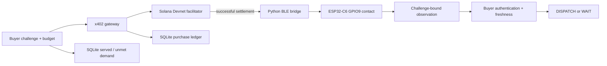

# FieldProof architecture

FieldProof routes a physical question to an observer, authenticates fresh evidence, and returns an operational decision.
The overnight MVP uses a single contact at `demo-gate`. The BOOT button is a physical stand-in.

## Components

| Component | Responsibility | Source |
|---|---|---|
| Contact capability | Sample GPIO9 without driving the boot strap | `firmware/esp32/main/capabilities/contact_capability.c` |
| Dispatcher | Validate authorization, serialize transport access, protect replay state, authenticate receipt | `firmware/esp32/main/protocol/capmesh_dispatcher.c` |
| Receipt identity | Generate and retain a P-256 signing key in NVS | `firmware/esp32/main/protocol/receipt_identity.c` |
| BLE / HTTP | Carry the same request and receipt | `host/capmesh/transport/`, `firmware/esp32/main/transport/` |
| Observation contract | Pin metric, location, budget, and freshness | `host/capmesh/observations.py` |
| Rehearsal market | Try candidates by price, reject stale evidence, record demand | `host/capmesh/market.py` |
| Gateway | Enforce x402 verification and settlement before measurement | `gateway/server.js` |
| Purchase ledger | Prevent duplicate settlement and preserve failure states | `gateway/store.js` |
| Paid buyer | Limit Devnet spending and check the receipt independently | `gateway/buyer.js` |
| Dispatch desk | Show quote, evidence, decision, age, limits, and local demand | `docs/overview.html` |
| Recorded inspector | Verify a device receipt in Web Crypto and independently read the recorded Devnet transfer | `docs/proof.js`, `docs/settlement.mjs` |
| Public export | Copy a fixed public-asset whitelist into a static inspector and ZIP | `scripts/export_judge_demo.py` |

## Trust boundaries

A manifest cannot establish its own provider identity. The buyer pins a device ID and P-256 public key through trusted USB provisioning.
The ESP32 signs observations with its persistent private key. The buyer rejects HMAC substitution and signatures from other keys.
The [identity runbook](RECEIPT_IDENTITY.md) defines provisioning, migration, and storage recovery.
Command authorization, simulated receipts, and LED compatibility retain the public demo HMAC.
The device key resides in unencrypted NVS. Physical flash access can extract it. Production identity still requires protected storage and firmware integrity.

The device timestamp derives from an authenticated host request and uptime. It is not independent time attestation.
The receipt establishes what this firmware reports about its GPIO samples. It does not establish external physical truth.
The five samples come from one observer. Independent sensing and calibrated confidence remain future work.

## Durable state and recovery

SQLite is the source of truth for each local ledger. WAL mode and a busy timeout support concurrent readers and writers.
The purchase ID, challenge nonce, and transaction message hash have database uniqueness constraints.
The hash excludes signature bytes because facilitator signing changes those bytes without creating another payment.
The busy timeout runs before WAL initialization, so concurrent startup can wait for a database lock.
An atomic reservation changes `quoted` to `settling` before the external settlement call.
Only the writer that obtains this reservation can settle and measure.

A successful purchase persists its receipt. Retrying returns that receipt and marks it cached.
A verifier must check its age again. The browser sets WAIT when the freshness window expires.

Settlement timeouts and crashes require review because an external chain transaction and local database cannot commit atomically.
The gateway preserves the unsettled state and refuses automatic repetition.
A successful settlement followed by unavailable hardware becomes `delivery_failed` and requires refund review.
The current gateway does not issue refunds.

## Integration modes

| Mode | Payment | Observation |
|---|---|---|
| `capmesh observe-demo --simulated` | Mock budget, no funds | Simulated contact and stale provider |
| `capmesh observe-demo` | Mock budget, no funds | Real ESP32 contact plus stale software provider |
| `npm run demo` | Simulated facilitator through x402 SDK | Simulated contact |
| `npm run demo -- --physical` | Simulated facilitator through x402 SDK | Real ESP32 contact |
| `npm start` | Public Solana Devnet facilitator | Real ESP32 contact after settlement |

The last mode completed a public-facilitator Devnet purchase and a real GPIO9 observation.
The [paid P-256 evidence](evidence/device-signed-purchase.json) records the current successful transaction and independently checked token balance changes.
The simulator cannot settle funds and exists only in a separate startup command.
Node's built-in SQLite avoids another production database dependency. It requires Node.js 22.13+ and currently emits an experimental-feature warning.
The x402 client and Solana Kit provide conforming transaction signing without a custom partial payment verifier.

## Recorded evidence and judge access

The browser inspector uses the installed buyer pin, not a key supplied by the recorded receipt.
Its chain check independently reads `getTransaction` from the fixed Solana Devnet RPC.
It requires successful execution, the expected signature, USDC mint, token program, payer, merchant, exact balance changes, and a matching transfer instruction.
This read trusts the selected RPC. It neither purchases evidence nor establishes payment-delivery atomicity.
The recorded receipt retains its original time and remains expired.
The input-pair section verifies two separately recorded BOOT readings against the same pin.
It checks both challenges, signatures, sample counts, and expired timestamps before displaying either row.
Damaged input evidence leaves that section unverified and preserves the separate paid-receipt inspector.
These input checks moved no funds. They do not establish an external gate installation.

The static export contains only public assets. It cannot access wallets, device authorization, purchase ledgers, or the physical bridge.
It works under a URL prefix. A remote host must serve it through HTTPS for browser cryptography.
The full simulator remains a separate local purchase rehearsal with explicit simulation labels.

The optional Agung diagnostic leaves the MVP runtime unchanged.
It reads the published peaq deployment and derives a proposed observer ID from the public pin.
No peaq write or activated identity exists. The [peaq integration decision](PEAQ_INTEGRATION.md) owns that separate path.
