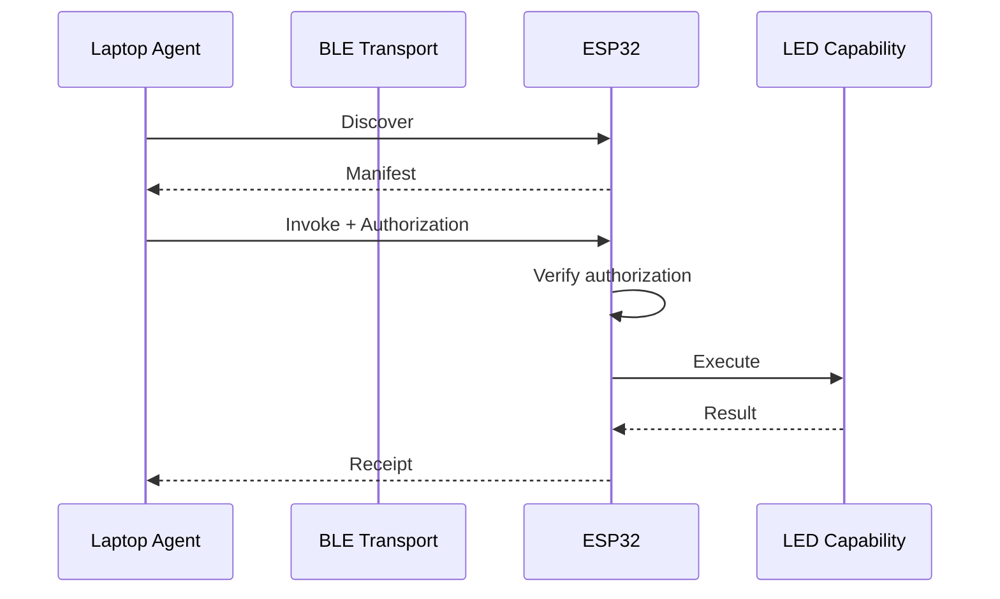
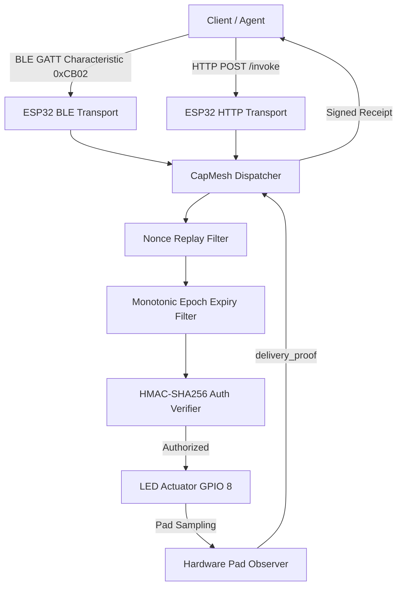
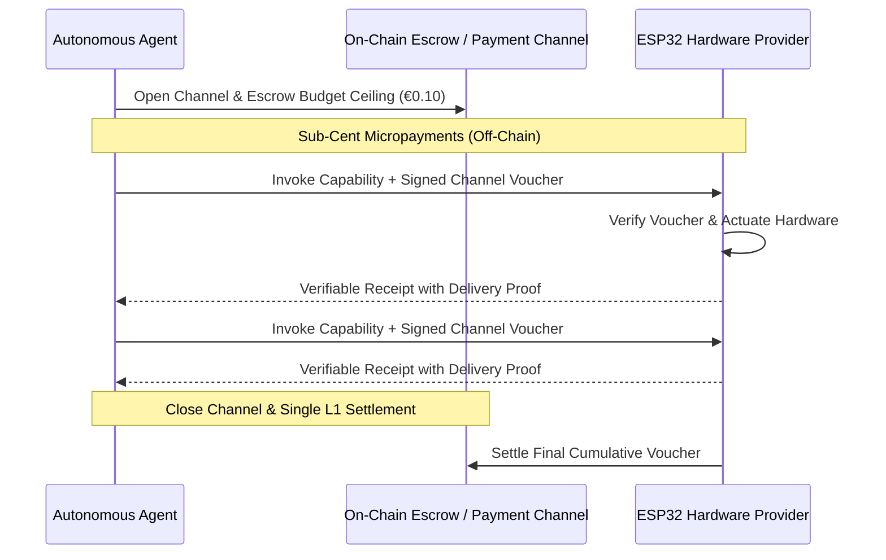

# CapMesh Architecture

CapMesh separates business capabilities from physical transports and economic settlement adapters.

## Layer Model

```text
┌──────────────────────────────────────────┐
│ Agent / Application Layer                │
│ Policy, discovery, provider selection    │
├──────────────────────────────────────────┤
│ Capability Protocol Layer                │
│ Manifest, Quote, Invoke, Receipt (JSON)  │
├──────────────────────────────────────────┤
│ Trust & Payment Adapter                  │
│ MockAuth -> BoundedAuth -> Solana Devnet │
├──────────────────────────────────────────┤
│ Transport Layer                          │
│ BLE GATT / Wi-Fi HTTP / Local IPC        │
├──────────────────────────────────────────┤
│ Device Adapter Layer                     │
│ ESP32-C6 / Linux Laptop / Android Seeker │
├──────────────────────────────────────────┤
│ Capability / Actuator Layer              │
│ LED, relay, compute, sensor, camera      │
└──────────────────────────────────────────┘
```

## Layer Responsibilities

1. **Agent / Application Layer**: Formulates goals (e.g. "blink a light under 0.01 USD"). Discovers providers across available transports, evaluates manifests, picks candidates based on policy.
2. **Capability Protocol Layer**: Defines standard data schemas and semantics. Formats requests, manifests, receipts, and error structures. Does not depend on the physical network.
3. **Trust & Payment Adapter Layer**: Manages cryptographic proof of payment or authorized execution tokens. Verifies that the client has the right to invoke the capability.
4. **Transport Layer**: Carries raw bytes between machines. Transports include Bluetooth Low Energy (GATT characteristics), Wi-Fi (HTTP REST endpoints), or local UNIX sockets.
5. **Device Adapter Layer**: Bridges platform-specific APIs (ESP-IDF FreeRTOS tasks, Linux async loops) to the capability dispatcher.
6. **Capability Layer**: Executes physical or computational actions (GPIO toggling, SHA-256 calculation, sensor reading). Contains zero transport or networking code.

## Protocol Sequence

The following diagram illustrates the lifecycle of a single capability invocation:



## Transport Independence

The logical flow does not change when the transport changes:



## Physical Delivery Proof Architecture

To solve the physical actuator oracle problem (where a provider merely asserts execution occurred without evidence), CapMesh implements an independent hardware observer:

1. **Actuator Pin Mode**: Configured as `GPIO_MODE_INPUT_OUTPUT`.
2. **Synchronous Readback**: On every pulse cycle, after driving the pin high or low, the input buffer samples the voltage level directly on the physical pad.
3. **Receipt Delivery Proof**:
```json
{
  "delivery_proof": {
    "observer_id": "esp32_gpio8_hw_pad",
    "expected_state": "PULSED",
    "observed_state": "ACTIVE_HIGH",
    "verified_samples": 5,
    "total_samples": 5,
    "readback_verified": true
  }
}
```

## Pluggable Settlement & Micropayment Channels

To enable $0.001 capability transactions without per-invocation L1 blockchain gas overhead:


