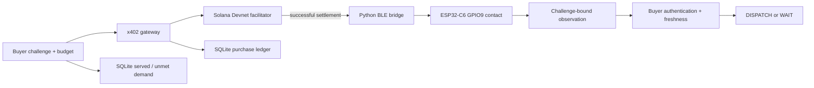

# FieldProof architecture

FieldProof routes a physical question to an observer, authenticates fresh evidence, and returns an operational decision.
The overnight MVP uses a single contact at `demo-gate`. The BOOT button is a physical stand-in.

## Components

| Component | Responsibility | Source |
|---|---|---|
| Contact capability | Sample GPIO9 without driving the boot strap | `firmware/esp32/main/capabilities/contact_capability.c` |
| Dispatcher | Validate authorization, serialize transport access, protect replay state, authenticate receipt | `firmware/esp32/main/protocol/capmesh_dispatcher.c` |
| BLE / HTTP | Carry the same request and receipt | `host/capmesh/transport/`, `firmware/esp32/main/transport/` |
| Observation contract | Pin metric, location, budget, and freshness | `host/capmesh/observations.py` |
| Rehearsal market | Try candidates by price, reject stale evidence, record demand | `host/capmesh/market.py` |
| Gateway | Enforce x402 verification and settlement before measurement | `gateway/server.js` |
| Purchase ledger | Prevent duplicate settlement and preserve failure states | `gateway/store.js` |
| Paid buyer | Limit Devnet spending and check the receipt independently | `gateway/buyer.js` |
| Dispatch desk | Show quote, evidence, decision, age, limits, and local demand | `docs/overview.html` |

## Trust boundaries

A manifest cannot establish its own provider identity. The buyer pins a known device ID and demo key.
The shared public HMAC key authenticates the demonstration's wire fields. It cannot resist a hostile reader of this repository.
Production requires per-device provisioning or asymmetric identity with a protected private key.

The device timestamp derives from an authenticated host request and uptime. It is not independent time attestation.
The receipt establishes what this firmware reports about its GPIO samples. It does not establish external physical truth.
The five samples come from one observer. Independent sensing and calibrated confidence remain future work.

## Durable state and recovery

SQLite is the source of truth for each local ledger. WAL mode and a busy timeout support concurrent readers and writers.
The purchase ID, challenge nonce, and transaction proof have database uniqueness constraints.
An atomic reservation changes `quoted` to `settling` before the external settlement call.
Only the writer that obtains this reservation can settle and measure.

A successful purchase persists its receipt. Retrying returns that receipt and marks it cached.
A verifier must check its age again. The browser sets WAIT when the freshness window expires.

Settlement timeouts and crashes require review because an external chain transaction and local database cannot commit atomically.
The gateway preserves the unsettled state and refuses automatic repetition.
A successful settlement followed by unavailable hardware becomes `delivery_failed` and requires refund review.
The current gateway does not issue refunds.

## Integration modes

| Mode | Payment | Observation |
|---|---|---|
| `capmesh observe-demo --simulated` | Mock budget, no funds | Simulated contact and stale provider |
| `capmesh observe-demo` | Mock budget, no funds | Real ESP32 contact plus stale software provider |
| `npm run demo` | Simulated facilitator through x402 SDK | Simulated contact |
| `npm run demo -- --physical` | Simulated facilitator through x402 SDK | Real ESP32 contact |
| `npm start` | Public Solana Devnet facilitator | Real ESP32 contact after settlement |

The last mode's quote is verified. Its paid request still needs verification with a disposable funded Devnet USDC buyer.
The simulator cannot settle funds and exists only in a separate startup command.
Node's built-in SQLite avoids another production database dependency. It requires Node.js 22.13+ and currently emits an experimental-feature warning.
The x402 client and Solana Kit provide conforming transaction signing without a custom partial payment verifier.
