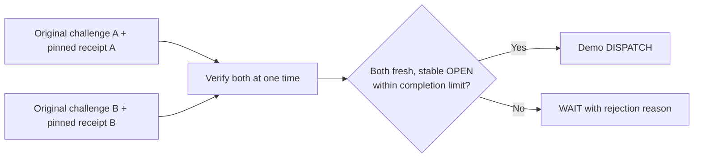

# Verify two contact observers

**The software requires both configured observers before DISPATCH. Two-board physical verification remains open.**
Audience: the founder who explains the extension and the developer who connects two receipt sources.
This document owns the pair policy. [Contact setup](CONTACT_SETUP.md) owns device configuration and trusted public pins.

## Understand the rule

Each observer answers the same contact question at `demo-gate` under its own original buyer challenge.
The buyer selects two distinct provider IDs, two distinct P-256 public pins, and each observer's exact physical sensor descriptor.
The verifier checks both receipts at one evaluation time. It requires five matching samples from each input.
The default limits are ten seconds of evidence age and two seconds between signed completion times.

| Observer A | Observer B | Pair decision |
|---|---|---|
| Fresh, stable OPEN | Fresh, stable OPEN | DISPATCH |
| Fresh, stable CLOSED | Fresh, stable CLOSED | WAIT: contact closed |
| Fresh, stable OPEN | Fresh, stable CLOSED | WAIT: observer disagreement |
| Any state | Missing, stale, unstable, invalid, or replayed receipt | WAIT: unmet evidence requirement |
| Both otherwise acceptable | Completion times differ by more than two seconds | WAIT: observation skew |

The rule requires both observers. It never selects the cheaper or more convenient answer after disagreement.
The output keeps `confidence: null`. Distinct keys do not establish independent sensing, correct installation, or calibrated confidence.
Two sensors on the same broken circuit can agree on an incorrect OPEN state.
DISPATCH remains a demo recommendation. The controller retains access permission and motion-safety checks.



## Rehearse without hardware or funds

Prerequisites: [README Python setup](../README.md#run-without-hardware). Start at the repository root.

```bash
uv run --project host capmesh corroborate-demo --scenario all
```

Expect eight results and exit code zero. Only `open` returns DISPATCH.
`closed`, `conflict`, `missing`, `stale`, `skew`, `invalid`, and `replay` return WAIT with their specific reasons.
For the replay scene, `first_decision` records DISPATCH before the repeated pair returns WAIT.

Every result states `SIMULATED SIGNED FIXTURES`, `hardware_used: false`, and `none; no funds moved`.
The command generates temporary signing keys in memory. It exports no private key and accesses no radio, network, or wallet.
The fixture uses physical-style GPIO descriptors to exercise the exact contract. Those descriptors do not claim an actual sensor installation.

To isolate one scene, run:

```bash
uv run --project host capmesh corroborate-demo --scenario conflict
```

Use this scene after the main paid-receipt demonstration if time permits.
Say: two individually authentic answers can conflict, so the buyer waits.
The command demonstrates a tested decision policy. It does not demonstrate two physical boards or two paid deliveries.

## Integrate original requests and receipts

`host/capmesh/corroboration.py` supplies three types:

| Type | Caller responsibility |
|---|---|
| `ContactObserver(provider, sensor, public_key)` | Supply the selected provider, supported physical sensor, and trusted `ReceiptPublicKey`. |
| `ObserverEvidence(request, receipt)` | Retain the buyer's original `InvocationRequest` and its returned `InvocationReceipt`. |
| `ContactPairVerifier(observers, max_age_seconds=10, max_completion_skew_seconds=2)` | Configure exactly two observers and retain this verifier instance across evaluations. |

Call `verifier.verify({provider_a: evidence_a, provider_b: evidence_b})` after collection.
The verifier samples the current time once. Explicit `now` exists for deterministic tests and recorded-history checks.
Never derive the original challenge from the receipt. Never install a key from the receipt or discovery result.
`provisioned_observation_keys(path)` loads the independently provisioned public pin file.

The verifier returns WAIT for missing, extra, malformed, or unacceptable evidence.
Invalid trusted configuration raises `ValueError` before evidence verification.
The result identifies verified observations and rejection reasons. It grants no individual DISPATCH while the pair remains unmet.

## Keep expiry and replay behavior explicit

The pair expires at the earliest member's completion time plus its freshness limit, or either original request's expiration.
`valid_until_epoch_seconds` records that bound. It does not refresh either observation.
At that final second, the time comparison still accepts the bound. At the next second, verification rejects expired evidence.
A controller must compare its current time with the bound again before use.

A missing, invalid, stale, or skewed pair consumes neither member.
The caller can recover a valid partial response by supplying its missing acceptable partner within both validity windows.
A complete, timely pair consumes both provider/nonce tokens, including CLOSED and disagreement results.
This prevents later reuse of a conflicting pair's OPEN member.

A lock makes verification and consumption atomic within one verifier instance.
A captured copy prevents caller mutation from changing the authenticated decision.
Replay state remains in memory. A process restart clears it.
No durable robot-action ledger, payment aggregation, or cross-process action guarantee exists.

## Pass the physical gates before extending the paid demo

The gateway and paid buyer still deliver and verify one provider per purchase.
This policy adds no collection loop, second payment, or paired purchase endpoint.
The [hardware acceptance plan](HARDWARE_NEXT.md#acceptance-gates-for-each-upgrade) owns the physical extension.

The current single-board BLE round trip takes about thirteen seconds in the running diagnostic.
Sequential collection can expire the first receipt before the second returns.
Do not widen the ten-second useful-time window merely to make the pair pass.
Measure concurrent or faster collection, actual completion skew, and end-to-end age when a second board becomes available.
The two-second skew limit is a selected demo policy. Host-anchored timestamps do not prove independent clock accuracy.

The next physical result needs separately provisioned keys, checked sensor placement, OPEN/CLOSED readings, disagreement, missing input, stale input, and swapped-key rejection.
Keep the verified one-board entry and recorded inspector until the extension passes those gates.
The [verification record](VERIFICATION.md) owns executed results.
