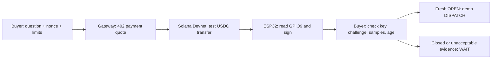

# Run the demo and explain the decision

Start here before recording. Your goal: explain what the buyer pays for, what the device signs, and why evidence expires.
The [complete explanation](HOW_IT_WORKS.html#understand) covers each component. This page owns the short rehearsal.

## Learn the loop

The company hypothesis is machines buying and verifying physical services from infrastructure another operator owns.
The first buyer hypothesis is a fleet software operator with repeated interactions at independent facilities.
The current prototype purchases a contact observation. It grants no access, reserves no service, and moves no robot.
The [product story](STRATEGY.md#the-story-to-explain) explains the buyer, provider, existing alternatives, and commercial acceptance target.

The **buyer** asks one question and sets a price and freshness limit.
The **gateway** quotes the observation and checks payment through x402, a machine-readable HTTP payment protocol.
After settlement, the **ESP32** reads its input and signs an answer.
The **buyer verifier** checks that answer before it derives DISPATCH or WAIT.
Before payment, the buyer and gateway compare the selected device, sensor, and independently provisioned public key.
Each quote retains those settings. A gateway restart cannot rewrite its promised input or signing key.

A **nonce** identifies this question. The signature binds that nonce to the answer.
The **public pin** tells the buyer which device key it trusts. Discovery cannot replace it.
**Freshness** tells the buyer whether the answer remains useful now. A signature never resets that clock.
DISPATCH is a demo recommendation. A real controller retains access permission and motion-safety checks.

## Know which evidence you show

| Scene | Payment | Input | What it establishes |
|---|---|---|---|
| Dispatch desk simulation | Fake facilitator, no funds moved | Simulated contact | Complete purchase flow and expiring decision |
| Recorded paid receipt | Actual public Devnet test-USDC transfer | Real ESP32 BOOT input | Payment integration and independently verified device receipt |
| Held/released pair | No payment in these checks | Two real BOOT states | Two signed input readings from the same pinned device |
| peaq readiness | No transaction | Public registry reads | Deployment readiness and a proposed observer ID |

The recorded observations are expired. They remain WAIT today.
Five matching samples come from one input. They do not represent five observers or a probability of correctness.

## Prepare two browser tabs

Prerequisites: the [README setup](../README.md#run-without-hardware). Run commands from the repository root.

1. Run `npm --prefix gateway run demo`.
2. Open the dispatch desk at `http://127.0.0.1:4022`.
3. Open `http://127.0.0.1:4022/proof` in a second tab.
4. Check VALID, MATCHES, 5/5 AGREE, EXPIRED, and WAIT.
5. Check VERIFIED INPUT PAIR below the payment section.
6. Select **Verify recorded payment** before the timed demonstration.
7. Check the successful transfer and unchanged expired WAIT.

If the RPC reports NOT VERIFIED, state that the current chain query failed.
Use the committed transaction evidence and local signature checks. Do not claim a successful current query.

The simulator invokes no hardware. This rehearsal requires no wallet and moves no funds.
Select **Focus demo** on the receipt tab to keep the answer, experiments, and checks together.
Select **Show full page** to restore payment queries, physical-state evidence, and reference details.
The focused view uses the same verifier and current time. It cannot make old evidence fresh.
For direct presentation access, open `/proof?present=1` through the gateway.
The [physical runbook](DEMO.md#real-hardware) adds live BOOT checks with simulated payment.
Close other BLE scans first. Keep BOOT released during reset.

## Explain the optional pair extension

After the core demonstration, run `uv run --project host capmesh corroborate-demo --scenario all`.
This command moves no funds and invokes no hardware. Every result states SIMULATED SIGNED FIXTURES.
Two fresh, stable OPEN answers produce DISPATCH. Disagreement, missing evidence, stale evidence, excessive skew, invalid signatures, and replay produce WAIT.
Two signing keys establish distinct configured identities. They do not establish independent sensing or a probability of correctness.
The [pair guide](CORROBORATION.md) explains expiry, recovery, and the remaining two-board collection gate.
Keep this scene optional in the timed video. The main purchase still uses one board.

## Rehearse a 150-second technical demonstration

Use these cues in your own words. They are demonstration prompts, not submission-field answers.

| Time | Action | Point to explain |
|---|---|---|
| 0:00–0:20 | Describe a fleet and a facility that belong to separate operators | Target workflow: buy and verify a physical service. The implemented first step purchases an observation. No customer exists yet. |
| 0:20–0:55 | Get the quote. Run simulation. Wait eleven seconds. | Machine-readable terms, simulated purchase, DISPATCH, then expired WAIT. |
| 0:55–1:20 | Switch to the prepared receipt tab | Actual recorded test payment and real device signature. Payment verification cannot refresh evidence. |
| 1:20–1:55 | Flip state. Change challenge. Use another key. Restore original. | Changed state fails its signature. Another nonce fails binding. Another key fails authentication. |
| 1:55–2:10 | Show the two signed physical input rows | Held means CLOSED. Released means OPEN. These separate checks moved no funds. |
| 2:10–2:30 | Explain the next buyer test and peaq status | Validate a missing fact, operator permission, useful lifetime, and real budget. peaq activation remains incomplete. |

Keep the startup presentation separate from this technical demonstration.
Explain the buyer's existing alternative, your actual learning, the next commercial test, and your motivation.
Colosseum requests a 2–3 minute presentation and a product demonstration of at most three minutes. [Official submission guidance](https://colosseum.com/hackathon?year=fall2026)

## Explain these six answers without notes

1. Why does the receipt need a device signature when Solana already signs transactions?

Solana transaction signatures authorize payment. The device signature binds the observation fields to the pinned device key.
Neither signature alone establishes truthful sensing or successful delivery.

2. Why does an authentic OPEN receipt remain WAIT?

Its useful-time window expired. The buyer needs another observation for another current decision.
A different challenge also requires a receipt that binds its new nonce.

3. What happens when payment succeeds but the device disappears?

The gateway preserves the settlement and purchase ID. It records delivery_failed for manual review.
Automatic refunds do not exist. A retry cannot silently settle the same purchase again.

4. What does the physical demonstration establish?

The board reads GPIO9 and signs the reported state. BOOT represents a contact.
Configured-input software now supports an external fixture. New physical readings must verify its actual installation before the demo claims that result.
It establishes neither a working external gate nor robot movement, safe passage, location attestation, or production security.

5. What does peaq do today?

The diagnostic reads Agung registry contracts and derives a proposed ID from the public device pin.
It validates the public key and deployment checks. No observer identity is activated.
The intended next integration binds operator identity, the public key, and a service endpoint. Solana remains the demonstrated payment rail.

6. Why will someone buy this instead of using a camera or ordinary API?

That remains the commercial hypothesis. Test a buyer who lacks a useful fact from infrastructure another operator controls.
If its camera or existing API supplies the fact reliably, record that result and revise the workflow.
The potential business depends on useful authorized supply, repeat buyers, and delivery economics.
Open-RMF already connects fleets and infrastructure. FieldProof must establish an additional commercial problem around terms, payment, evidence, and recovery.

## Prepare the strongest next evidence

The next commercial test needs one actual incident, the current alternative, the useful-time window, operator permission, and a buyer budget.
Record each answer from the buyer. Leave unknown values unknown.
The [bounty plan](BOUNTY_PLAN.md) owns registration, public links, human submission, and deadlines.
The [verification record](VERIFICATION.md) owns executed tests and technical limits.
