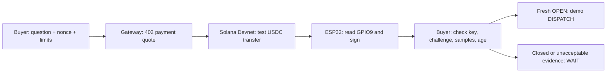

# Run the demo and explain the decision

Start with [the illustrated founder guide](HOW_IT_WORKS.html). Your goal: explain the payment, radio, signed answer, and acceptance checks.
Use its launcher stages to rehearse yourself. This page owns timed recording cues and the six explanation questions.

## Learn the loop

The company hypothesis is machines buying and verifying physical services from infrastructure another operator owns.
The first buyer hypothesis is a fleet software operator with repeated interactions at independent facilities.
The current prototype purchases a contact observation. It grants no access, reserves no service, and moves no robot.
The [product story](STRATEGY.md#the-story-to-explain) explains the buyer, provider, existing alternatives, and commercial acceptance target.

The **buyer** asks one question and sets a price and freshness limit.
The **gateway** quotes the observation and checks payment through x402, a machine-readable HTTP payment protocol.
After settlement, the **ESP32** reads its input and signs an answer.
The **buyer verifier** checks that answer before it derives DISPATCH or WAIT.
Before payment, the buyer and gateway compare the selected device, sensor, and independently provisioned public key.
Each quote retains those settings. A gateway restart cannot rewrite its promised input or signing key.

A **nonce** identifies this question. The signature binds that nonce to the answer.
The **public pin** tells the buyer which device key it trusts. Discovery cannot replace it.
**Freshness** tells the buyer whether the answer remains useful now. A signature never resets that clock.
DISPATCH is a demo recommendation. A real controller retains access permission and motion-safety checks.

## Know which evidence you show

| Scene | Payment | Input | What it establishes |
|---|---|---|---|
| Dispatch desk simulation | Fake facilitator, no funds moved | Simulated contact | Complete purchase flow and expiring decision |
| Recorded paid receipt | Actual public Devnet test-USDC transfer | Real ESP32 BOOT input | Payment integration and independently verified device receipt |
| Held/released pair | No payment in these checks | Two real BOOT states | Two signed input readings from the same pinned device |
| peaq readiness | No transaction | Public registry reads | Deployment readiness and a proposed observer ID |

The recorded observations are expired. They remain WAIT today.
Five matching samples come from one input. They do not represent five observers or a probability of correctness.

## Prepare two browser tabs

Open [the payment-to-observation picture](assets/fieldproof-payment-to-observation.svg) before the timed demonstration.
Point to the USDC path first, then the Bluetooth request and signed answer. The ESP32 submits no Solana transaction.
Open `/proof#payment` for the actual recorded transfer, both wallets, Explorer link, and read-only current query.
The simulator's **Run simulation** button creates no chain transaction.

Prerequisites: the [README setup](../README.md#run-without-hardware). Run commands from the repository root.

1. Run `npm --prefix gateway run demo`.
2. Open the dispatch desk at `http://127.0.0.1:4022`.
3. Open `http://127.0.0.1:4022/proof` in a second tab.
4. Check VALID, MATCHES, 5/5 AGREE, EXPIRED, and WAIT.
5. Check VERIFIED INPUT PAIR below the payment section.
6. Select **Verify recorded payment** before the timed demonstration.
7. Check the successful transfer and unchanged expired WAIT.

If the RPC reports NOT VERIFIED, state that the current chain query failed.
Use the committed transaction evidence and local signature checks. Do not claim a successful current query.

The simulator invokes no hardware. This rehearsal requires no wallet and moves no funds.
Select **Focus demo** on the receipt tab to keep the answer, experiments, and checks together.
The robot-and-gate illustration follows the receipt claim and the actual verifier decision. It shows no live gate or robot motion.
Select **Show full page** to restore receipt metadata, physical-state evidence, and reference details.
The payment query remains visible in both views.
The focused view uses the same verifier and current time. It cannot make old evidence fresh.
For direct presentation access, open `/proof?present=1` through the gateway.

## Explain the recorded proof in one minute

1. Point to the visiting robot and the external operator's gate.
2. Select **Verify recorded payment** in the payment panel.
3. State the result you observe. This query moves no funds.
4. Return to the original receipt. Point to VALID, OPEN, EXPIRED, and WAIT.
5. Explain that a paid, authentic answer still needs a current useful-time window.
6. Select **Flip contact state**. Point to the rejected signature and unchanged WAIT.
7. Restore the original receipt. Explain the separate live BOOT rehearsal.

Use the actual recorded transaction for payment evidence. Use the physical browser for a new input with simulated settlement.

## Add live hardware after the recorded proof

The [physical runbook](DEMO.md#real-hardware) adds live BOOT checks with simulated payment.
Close other BLE scans first. Keep BOOT released during reset.

For a complete real payment and input flow, use the [paid-run procedure](DEMO.md#show-one-new-paid-buyer-run).
The October 5 run passed on the laptop and Seeker. Both verified payment, accepted fresh OPEN, and changed to expired WAIT.
The [public buyer output](evidence/device-signed-purchase-20261005.json) preserves its original signed times. It is expired now.
The Seeker acts as a browser verifier. It is not a sensor, payment signer, or BLE relay.
The continuous 32.8-second capture remains local. A ten-second excerpt preserves its fresh-to-expired transition at original speed.
Use that excerpt inside your founder explanation. Keep the complete capture as supporting evidence.

## Explain the optional pair extension

After the core demonstration, run `uv run --project host capmesh corroborate-demo --scenario all`.
This command moves no funds and invokes no hardware. Every result states SIMULATED SIGNED FIXTURES.
Two fresh, stable OPEN answers produce DISPATCH. Disagreement, missing evidence, stale evidence, excessive skew, invalid signatures, and replay produce WAIT.
Two signing keys establish distinct configured identities. They do not establish independent sensing or a probability of correctness.
The [pair guide](CORROBORATION.md) explains expiry, recovery, and the remaining two-board collection gate.
Keep this scene optional in the timed video. The main purchase still uses one board.

## Record one 150-second walkthrough

Use this route for the Germany MVP. The local start page links one recording script and the actual October 5 paid excerpt.
Use the [recording script](RECORDING_SCRIPT.md) for four separate clips, plain spoken text, exact actions, and OBS setup.
You need the existing ESP32, laptop, and optional Seeker. No new hardware is required.
For a fresh checkout, use the [expiry illustration](assets/fieldproof-evidence-window.svg), [payment diagram](assets/fieldproof-payment-to-observation.svg), and [pilot plan](STRATEGY.md#validate-one-relationship).
The founder's recording frames and paid capture stay local. The repository includes the public evidence and captioned technical fallback.

Before recording:

1. Read the recording script's hardware status before the live BOOT scene.
2. Open the focused physical page at `http://127.0.0.1:4023/?present=1`.
3. Open the saved paid inspector at `http://127.0.0.1:4021/proof?live=1&present=1`.
4. Check VALID, VERIFIED TRANSFER, EXPIRED, and WAIT in the saved inspector.
5. Follow the script's five-second recording test before the main take.

Handle the reported Germany cooldown with Carlo in parallel. Confirm eligibility and the human submission route before submitting.

The paid inspector reads saved output and queries Solana. Reloading sends no funds and does not refresh the evidence.
If port 4021 is unavailable, use the exported inspector and import its October 5 public JSON.
Follow the [paid-run procedure](DEMO.md#show-one-new-paid-buyer-run) only when you need another actual purchase.

The script owns four clips: opening, physical input, actual payment and rejection, and ending.
Use your face for the opening and ending. Keep the physical action and its result together within the hardware clip.
The focused screens show the reading, signature, payment, age, and decision. They contain no robot or gate illustration.
Parcel pickup is a possible application. The live hardware uses BOOT as a test input, not a package sensor.
The physical page's `?present=1` view keeps its payment mode visible and changes only presentation.
The inspector's focused view emphasizes payment, signature, age, and decision.
Select **Show full page** for the challenge, sample, and additional attack controls. All verification checks still run in focused view.

Keep the current saved receipt expired. Never change its clock or timestamps for a recording.
Use the continuous capture to show its actual fresh state and expiry. State that it is recorded footage.
One attack is enough for this walkthrough. The repo tests cover the other rejection and recovery paths.

If you add a new live BOOT reading, use the physical gateway and label its settlement as simulated.
Keep the complete actual purchase capture as the Solana evidence.
The [hardware plan](HARDWARE_NEXT.md#highest-value-with-almost-no-lab-time) owns optional ready-for-pickup contact parts.
The next useful device expansion follows a buyer need and a separate sensing contract.

### Visual direction

Use the existing workshop palette: warm paper, dark ink, blue links, teal verified results, amber WAIT, and red rejection.
Use plain type for explanations and monospace for time, amounts, and evidence.
The evidence-age bar is the main visual device. It shows the signed measurement's age against the buyer's limit.
Keep real verification and teaching examples visibly labeled. Use the same styles in the guide, inspector, and recording frames.
The current diagrams cover the explanation. No generated artwork is required for this submission.

Keep the startup presentation separate from this technical demonstration.
Explain the buyer's existing alternative, your actual learning, the next commercial test, and your motivation.
Colosseum requests a 2–3 minute presentation and a product demonstration of at most three minutes. [Official submission guidance](https://colosseum.com/hackathon?year=fall2026)

For that later presentation, reuse the problem and pilot frames. Add your own motivation, customer learning, and distribution plan.
The [submission checklist](SUBMISSION.md#required-fields-that-remain-incomplete) owns public links and human tasks. Verify each link while signed out.

## Explain these six answers without notes

1. Why does the receipt need a device signature when Solana already signs transactions?

Solana transaction signatures authorize payment. The device signature binds the observation fields to the pinned device key.
Neither signature alone establishes truthful sensing or successful delivery.

2. Why does an authentic OPEN receipt remain WAIT?

Its useful-time window expired. The buyer needs another observation for another current decision.
A different challenge also requires a receipt that binds its new nonce.

3. What happens when payment succeeds but the device disappears?

The gateway preserves the settlement and purchase ID. It records delivery_failed for manual review.
Automatic refunds do not exist. A retry cannot silently settle the same purchase again.

4. What does the physical demonstration establish?

The board reads GPIO9 and signs the reported state. BOOT represents a contact.
Configured-input software now supports an external fixture. New physical readings must verify its actual installation before the demo claims that result.
It establishes neither a working external gate nor robot movement, safe passage, location attestation, or production security.

5. What does peaq do today?

The diagnostic reads Agung registry contracts and derives a proposed ID from the public device pin.
It validates the public key and deployment checks. No observer identity is activated.
The intended next integration binds operator identity, the public key, and a service endpoint. Solana remains the demonstrated payment rail.

6. Why will someone buy this instead of using a camera or ordinary API?

That remains the commercial hypothesis. Test a buyer who lacks a useful fact from infrastructure another operator controls.
If its camera or existing API supplies the fact reliably, record that result and revise the workflow.
The potential business depends on useful authorized supply, repeat buyers, and delivery economics.
Open-RMF already connects fleets and infrastructure. FieldProof must establish an additional commercial problem around terms, payment, evidence, and recovery.

## Prepare the strongest next evidence

The next commercial test needs one actual incident, the current alternative, the useful-time window, operator permission, and a buyer budget.
Record each answer from the buyer. Leave unknown values unknown.
The [bounty plan](BOUNTY_PLAN.md) owns registration, public links, human submission, and deadlines.
The [verification record](VERIFICATION.md) owns executed tests and technical limits.
